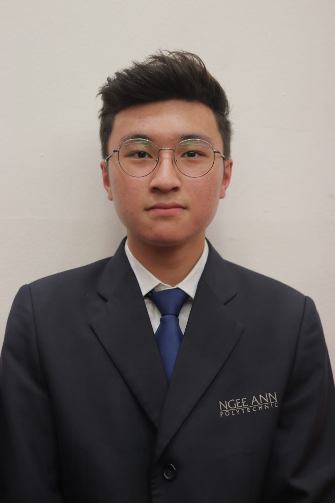
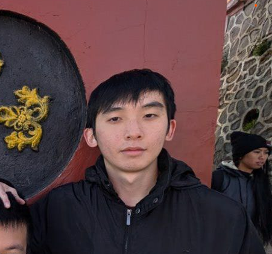
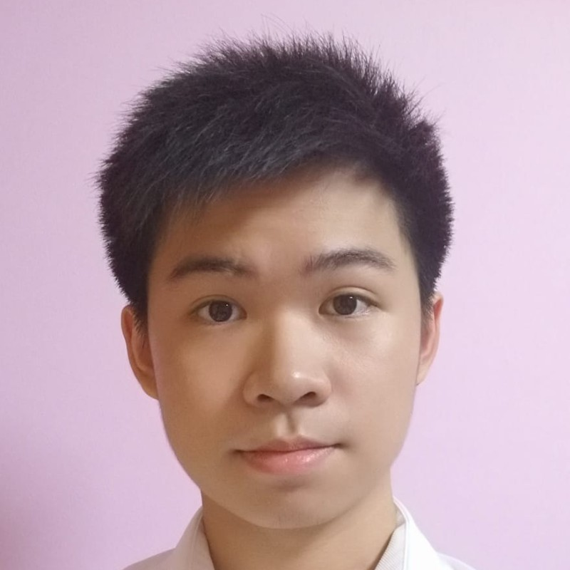
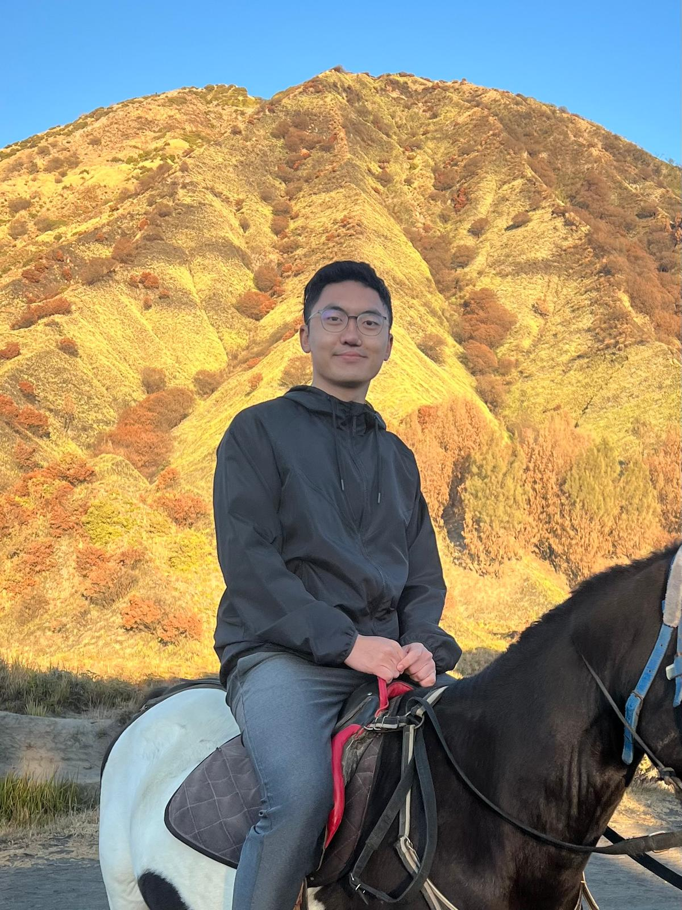
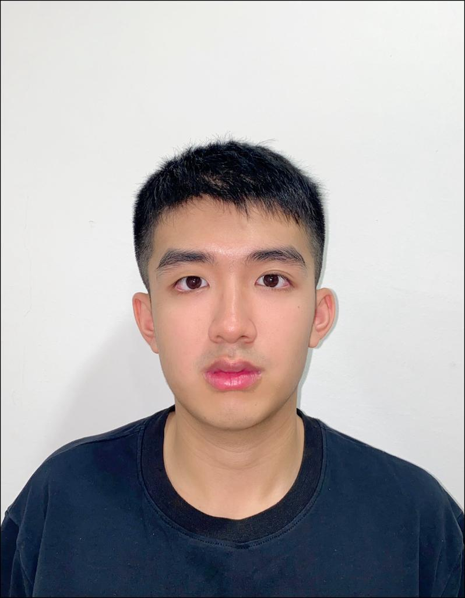

# About Us

We are a team based in the [School of Computing, National University of Singapore](http://www.comp.nus.edu.sg).

You can reach us at the email `seer[at]comp.nus.edu.sg`

## Project team

### Justin Chan

[[github](https://github.com/chanism0808)]

* Role: Project Advisor

### Tan Wei Jun

[[github](https://github.com/maybeweijun)]

* Role: Project Engineer

### Christopher Chong

[[github](https://github.com/christopherchong)]

* Role: Project Advisor

### Chen Junyao

[[github](https://github.com/ChewyMochi)]

* Role: Developer

### Louis Teng

[[github](http://github.com/louist3ng)]
[[portfolio](team/louist3ng.md)]

* Role: Idk
* Responsibilities: Idk
