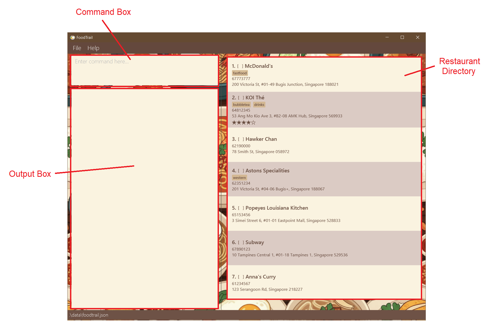

# FoodTrail User Guide

Tired of forgetting that amazing little restaurant you found last month? **FoodTrail** is here to help! It's a **desktop application** designed **for food lovers** like you to keep a diary of all the restaurants you've visited or want to try. If you're comfortable typing, you'll find **FoodTrail** a superfast way to **organize your culinary adventures**.  

<!-- * Table of Contents -->
<page-nav-print />

## Table of Contents
* [Installation Guide](#installation-guide)
* [Parameters](#parameters)
* [Features](#features)
    * [Viewing help: `help`](#viewing-help-help)
    * [Adding a restaurant: `add`](#adding-a-restaurant-add)
    * [Listing all restaurants: `list`](#listing-all-restaurants-list)
    * [Editing a restaurant: `edit`](#editing-a-restaurant-edit)
    * [Locating restaurants: `find`](#locating-restaurants-find)
    * [Deleting a restaurant: `delete`](#deleting-a-restaurant-delete)
    * [Marking a restaurant: `mark`](#marking-a-restaurant-mark)
    * [Unmarking a restaurant: `unmark`](#unmarking-a-restaurant-unmark)
    * [Rating a restaurant: `rate`](#rating-a-restaurant-rate)
    * [Removing a restaurant rating: `unrate`](#removing-a-restaurant-rating-unrate)
    * [Tagging a restaurant: `tag`](#tagging-a-restaurant-tag)
    * [Untagging a restaurant: `untag`](#untagging-a-restaurant-untag)
    * [Clearing all entries: `clear`](#clearing-all-entries-clear)
    * [Exiting the program: `exit`](#exiting-the-program-exit)
* [Saving the data](#saving-the-data)
* [Editing the data file](#editing-the-data-file)
* [FAQ](#faq)
* [Known issues](#known-issues)
* [Command summary](#command-summary)

--------------------------------------------------------------------------------------------------------------------
## Introduction

This guide is designed to support all users, from first-time beginners to experienced users, in learning and using **FoodTrail** smoothly.

**For *new users*:**
<box>

* You can get started by installing the application using the [Installation Guide](#installation-guide).
</box>

**For *experienced users*:**
<box>

* You can check out [Command Summary](#command-summary) to get a quick overview of all the commands.
* You can also go to [Features](#features) to get a more detailed explanation of all the commands.
</box>

--------------------------------------------------------------------------------------------------------------------
## Installation Guide

This guide will act as a walkthrough on **installing FoodTrail** and **teach you how to use it**.

**Step 1: Install Java**
* FoodTrail needs a software called **Java** to run.
  * Check that you have **Java version 17** or higher installed on your computer.
  * If you are a Mac user, follow the instructions [here](https://se-education.org/guides/tutorials/javaInstallationMac.html) to install the correct version of the Java Development Kit (JDK).

**Step 2: Download the app file**
1. Click [here](https://github.com/AY2526S1-CS2103T-T14-3/tp/releases/download/v1.5/foodtrail.jar) to download the latest version of FoodTrail.
2. Store the downloaded file into a dedicated folder on your computer. This will be where FoodTrail stores all your data.

**Step 3: Run the app from the command terminal**
1. Open a command terminal.
   * On Windows: Search for "Command Prompt" or "PowerShell" and open it.
   * On Mac/Linux: Search for "Terminal" and open it.
2. Navigate to the folder where you stored FoodTrail in.
   * In the command terminal, type `cd /path/to/your/folder` and press Enter. 
     * Replace `/path/to/your/folder` with the actual path of the folder where you stored `foodtrail.jar`.
3. To start FoodTrail, type `java -jar foodtrail.jar` and press Enter. 
   * A window similar to the one below should appear shortly, pre-loaded with some sample data.

  

**Installation complete!**
* You can now type commands into the command box and press Enter to execute them.
* Refer to the [Features](#features) section below for a detailed explanation of every command.

--------------------------------------------------------------------------------------------------------------------
## Parameters

This section describes all the parameters used in FoodTrail commands, along with their meanings and any input rules or constraints.

| Parameter      | Description                                   | Constraints                                                                                                                                   |
|----------------|-----------------------------------------------|-----------------------------------------------------------------------------------------------------------------------------------------------|
| `NAME`         | Name of the restaurant                        | <li>Cannot be empty. <li>Maximum length of 60 characters.</li>                                                                                |
| `PHONE_NUMBER` | Phone number of the restaurant                | <li>Cannot be empty. </li><li>Only accepts 8-digit numbers that start with 6, 8, or 9. </li>                                                  |
| `ADDRESS`      | Address of the restaurant                     | <li>Cannot be empty. </li><li>Maximum length of 100 characters. </li><li>Must end with ', Singapore' followed by a 6-digit postal code. </li> |
| `TAG`          | Labels associated with the restaurant         | <li>Maximum length of 30 characters. </li><li>Accepts spaces. </li>                                                                           |
| `INDEX`        | Position of the restaurant in the directory   | <li>Only accepts numbers.</li><li>Number must correspond to a restaurant in the directory.</li>                                               |
| `KEYWORD`      | Information associated with the restaurant    | No constraints.                                                                                                                               |
| `RATING`       | Rating of the restaurant                      | <li>Only accepts 0, 1, 2, 3, 4, 5.</li>                                                                                                       |

 

## Features

This section explains all available commands and how to use them. If you’re already familiar with the app, you can jump ahead to the [Command summary](#command-summary) for a quick reference.

<box type="info" seamless>

**Notes about the command format:** 

* `UPPER_CASE` words represent parameters you need to provide. 
    <box>

    *Example:* `add n/NAME`, `NAME` is a parameter.
    </box>

* Square brackets `[ ]` indicate **optional** items. 
    <box>

    *Example:* `n/NAME [t/TAG]` can be used as `n/KFC t/fast food` or simply `n/KFC`.
    </box>

* An ellipsis `…`​ after an item means it can be repeated any number of times (including zero). 
    <box>

    *Example:* `[t/TAG]…` can be empty (` `), `t/fast food`, or `t/fast food t/halal` and so on.
    </box>

* Parameters can appear in any order. 
    <box>

    *Example:* `add n/NAME hp/PHONE_NUMBER a/ADDRESS` is the same as `add hp/PHONE_NUMBER a/ADDRESS n/NAME`.
    </box>

* Extra parameters are ignored for commands that don’t take any parameters (e.g. `help`, `list`, `exit`, `clear`). 
    <box>

    *Example:* Typing `help 123` will be treated the same as `help`.
    </box>
</box>

<box type="warning" seamless>

**Caution:** 
When copying commands that span multiple lines, make sure that the spaces around line breaks are preserved as some PDF readers may omit them.
</box>

 

### See all commands: `help`

If you are unsure of what commands there are, you can view all the commands by typing `help`.

Format: `help`

  

 

### Adding a restaurant: `add`

Want to keep track of a restaurant? You can do so by adding a restaurant to the directory using `add`.

Format: `add n/NAME a/ADDRESS hp/PHONE_NUMBER [t/TAG]…​`

<box type="info" seamless>

**Important:** 
* Restaurant details must include name, address and phone number.
* There must be a space between the `,` and `Singapore` for the address (e.g `..., Singapore`).
</box>

<box type="tip" seamless>

**Tip:** A restaurant can have any number of tags (including 0).
</box>

<box>

**Examples:**
* `add n/McDonald's a/1 Jelebu Road, #02-01, Bukit Panjang Plaza, Singapore 677743 hp/68928572`
* `add n/KFC a/701A Yishun Ave 5, #01-02, Singapore 761701 hp/62226111 t/fast food t/chicken`
</box>
 

### Listing all restaurants: `list`

You can get a list of all the restaurants in the directory using `list`.

Format: `list`

<box type="info" seamless>

**Important:**
* Restaurants are sorted by alphabetical order.
</box>
 

### Editing a restaurant: `edit`

Maybe a restaurant moved or changed its phone number? Keep their details updated using `edit`.

Format: `edit INDEX [n/NAME] [hp/PHONE] [a/ADDRESS]​`

<box type="info" seamless>

**Important:**
* Only the name, phone number, and address can be edited.
</box>

<box type="tip" seamless>

**Tip:**  
You can edit all details at once, or just a single field — name `n/`, phone `hp/`, or address `a/`.
</box>

<box>

**Examples:**
*  `edit 1 hp/91234567` edits the phone number of the 1st restaurant in the directory to be `91234567`.
*  `edit 2 n/KFC` edits the name of the 2nd restaurant in the directory to be `KFC`.
</box>
 

### Locating restaurants: `find`

You can search for restaurants in the directory by their name, address, phone number, or tag.

Format: `find KEYWORD[, MORE_KEYWORDS]`

<box type="info" seamless>

**Important:**
* The search is case-insensitive. e.g. `kfc` will match `KFC`.
* The order of the keywords matters. e.g. `chan hawker` will not match `Hawker Chan`.
</box>

<box type="tip" seamless>

**Tip:** Want broader results? Add more keywords, separated by commas — any restaurant matching one will appear in the list.
</box>

<box>

**Examples:**
* `find koi` returns `KOI Thé` and `KOI Thé Specialty`.
* `find subway, kfc` returns `Subway` and `KFC`.
* `find bugis` returns `Astons Specialties` and `McDonald's` since their addresses contain `bugis`.
</box>

  

 

### Deleting a restaurant: `delete`

You can delete a restaurant from the directory.

Format: `delete INDEX`

<box>

**Examples:**
* `list` followed by `delete 2` deletes the 2nd restaurant in the restaurant directory.
* `find KFC` followed by `delete 1` deletes the 1st restaurant in the results of the `find` command.
</box>
 

### Marking a restaurant: `mark`

To indicate that you've visited this restaurant, you can mark it as visited.

Format: `mark INDEX`

<box>

**Examples:**
* `mark 1` marks the 1st restaurant as visited.
* `mark 3` marks the 3rd restaurant as visited.
</box>
 

### Unmarking a restaurant: `unmark`

If you accidentally marked a restaurant as visited, you can unmark it using `unmark`.

Format: `unmark INDEX`

<box>

**Examples:**
* `unmark 1` unmarks the 1st restaurant as not visited.
* `unmark 3` unmarks the 3rd restaurant as not visited.
</box>
 

### Rating a restaurant: `rate`

You can give a rating to a restaurant in the directory.

Format: `rate INDEX RATING`

<box>

**Examples:**
* `rate 1 5` rates the 1st restaurant with 5 stars.
* `rate 3 3` rates the 3rd restaurant with 3 stars.
</box>
 

### Removing a restaurant rating: `unrate`

You can remove a rating for a restaurant.

Format: `unrate INDEX`

<box>

**Examples:**
* `unrate 1` removes the rating from the 1st restaurant.
* `unrate 3` removes the rating from the 3rd restaurant.
</box>
 

### Tagging a restaurant: `tag`

You can add a tag to a restaurant in the directory.

Format: `tag INDEX t/TAG [t/MORE_TAGS]`

<box type="info">

**Important:**
* Tags are displayed in alphabetical order.
</box>

<box type="tip" seamless>

**Tips:**
* Tags let you include extra details or keywords, such as “halal,” “cozy,” or “open late,” to help describe the restaurant better.
* Multiple tags can be added by entering more `t/` and specifying additional tags.
</box>

<box>

**Examples:**
* `tag 1 t/halal` tags the 1st restaurant with a `halal` tag.
* `tag 1 t/halal t/fast food` tags the 1st restaurant with a `halal` and a `fast food` tag.
</box>
 

### Untagging a restaurant: `untag`

You can remove tags from the restaurants in the directory.

Format: `untag INDEX t/TAG [t/MORE_TAGS]`

<box type="info" seamless>

**Important:**  

* Tags are displayed in alphabetical order.
</box>

<box type="tip" seamless>

**Tips:**  
* Multiple tags can be removed by entering more `t/` and specifying additional tags.
</box>

<box>

**Examples:**
* `untag 1 t/halal` removes the `halal` tag from the 1st restaurant.
* `untag 1 t/halal t/fast food` removes the `halal` and `fast food` tags from the 1st restaurant.
</box>
 

### Clearing all entries: `clear`

You can remove all the restaurants from the current directory. Use this command if you want to start with a fresh restaurant directory.

Format: `clear`

<box type="warning" seamless>

**Caution:**  
This command will delete all the data in the app.
</box>

 

### Exiting the program: `exit`

You can exit the application.

Format: `exit`

 

### Saving the data

FoodTrail automatically saves your data to your computer whenever you make a change. You don’t need to save anything manually.

 

### Editing the data file

Your FoodTrail data is automatically saved as a JSON file in `[JAR file location]/data/foodtrail.json`.
If you’re an advanced user, you can also edit this file directly to update your data.

<box type="warning" seamless>

**Caution:**  
If the data file is edited incorrectly or becomes invalid, FoodTrail will reset and start with an empty file on the next run.  
Be careful when making changes as incorrect values may cause the app to behave unexpectedly.

<box type="tip" seamless>

**Recommendation:**  
To avoid data loss, you should make a backup before editing.
</box>
</box>

--------------------------------------------------------------------------------------------------------------------

## FAQ

**Q**: Where is my restaurant data stored? 
**A**: FoodTrail stores your data locally on your computer. The exact location is usually within the application's data directory, ensuring your information is private and accessible offline.  
**Q**: How do I transfer my data to another Computer? 
**A**: Install the app in the other computer and overwrite the empty data file it creates with the file that contains the data of your previous FoodTrail home folder.

--------------------------------------------------------------------------------------------------------------------

## Known issues

| Problem                                                    | Description                                                                                                                                                                                           | Fix                                                                                                                                                                                |
|------------------------------------------------------------|-------------------------------------------------------------------------------------------------------------------------------------------------------------------------------------------------------|------------------------------------------------------------------------------------------------------------------------------------------------------------------------------------|
| Application opens off-screen after using multiple monitors | If you move the application to a secondary screen and later disconnect that screen (returning to a single display setup), the application window may open off-screen.                                 | Close the application and delete the `preferences.json` file created by the app. Then restart the application as it will reopen on your main screen with default display settings. |
| Help Window does not appear when reopened                  | If you minimize the Help Window and then try to open it again (using the help command, the Help menu, or the F1 shortcut), the existing Help Window will stay minimized instead of opening a new one. | Manually restore the minimized Help Window from your taskbar or dock.                                                                                                              |
---------------------------------------------------------------------------------------------------------------------------------------------------------------------------------------------------------------------------------------------------------------------------------------------------------------------------------------------------------------------------------------------------------------------------------------------------------

## Command summary

| Action                                             | Format                                                        | Examples                                                                                         |
|----------------------------------------------------|---------------------------------------------------------------|--------------------------------------------------------------------------------------------------|
| [**Help**](#viewing-help-help)                     | `help`                                                        | `help`                                                                                           |
| [**Add**](#adding-a-restaurant-add)                | `add n/NAME hp/PHONE_NUMBER a/ADDRESS [t/TAG]…​`              | `add n/KFC a/701A Bukit Batok Ave 5, #01-02, Singapore 761721 hp/62226121 t/fast food t/chicken` |
| [**List**](#listing-all-restaurants-list)          | `list`                                                        | `list`                                                                                           |
| [**Edit**](#editing-a-restaurant-edit)             | `edit INDEX [n/NAME] [hp/PHONE_NUMBER] [a/ADDRESS] [t/TAG]…​` | `edit 2 n/KFC hp/68849301`                                                                       |
| [**Find**](#locating-restaurants-find)             | `find KEYWORD[, MORE_KEYWORDS]`                               | `find koi, subway`                                                                               |
| [**Delete**](#deleting-a-restaurant-delete)        | `delete INDEX`                                                | `delete 3`                                                                                       |                                                                                                      | 
| [**Mark**](#marking-a-restaurant-mark)             | `mark INDEX`                                                  | `mark 3`                                                                                         |
| [**Unmark**](#unmarking-a-restaurant-unmark)       | `unmark INDEX`                                                | `unmark 3`                                                                                       |
| [**Rate**](#rating-a-restaurant-rate)              | `rate INDEX RATING`                                           | `rate 1 5`                                                                                       |
| [**Unrate**](#removing-a-restaurant-rating-unrate) | `unrate INDEX`                                                | `unrate 1`                                                                                       |                                                                                                      |
| [**Tag**](#tagging-a-restaurant-tag)               | `tag INDEX t/TAG [t/MORE_TAGS]`                            | `tag 3 t/fast food t/halal`                                                                      |
| [**Untag**](#untagging-a-restaurant-untag)         | `untag INDEX t/TAG [t/MORE_TAGS]`                             | `untag 3 t/fast food t/halal`                                                                    |
| [**Clear**](#clearing-all-entries-clear)           | `clear`                                                       | `clear`                                                                                          |
| [**Exit**](#exiting-the-program-exit)              | `exit`                                                        | `exit`                                                                                           |
