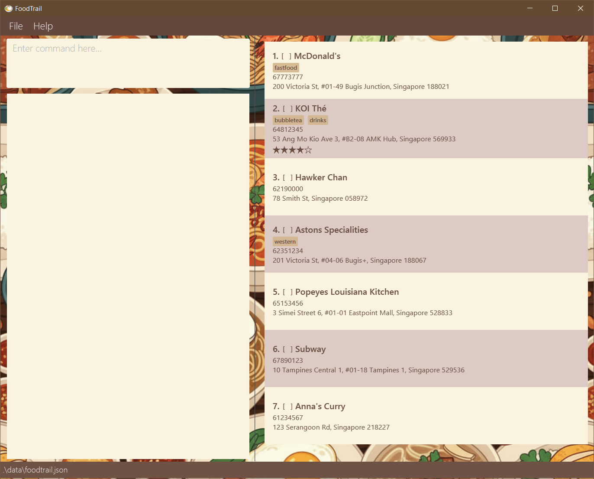

# FoodTrail User Guide

FoodTrail is a **desktop app for managing contacts, optimized for use via a  Line Interface** (CLI) while still 
having the benefits of a Graphical User Interface (GUI). If you can type fast, FoodTrail can log your favourite 
restaurants done faster than traditional GUI apps.

<!-- * Table of Contents -->
<page-nav-print />

--------------------------------------------------------------------------------------------------------------------

## Quick start

1. Ensure you have Java `17` or above installed in your Computer. 
   **Mac users:** Ensure you have the precise JDK version prescribed [here](https://se-education.org/guides/tutorials/javaInstallationMac.html).

2. Download the latest `.jar` file from [here](https://github.com/AY2526S1-CS2103T-T14-3/tp/releases/tag/v1.4).

3. Copy the file to the folder you want to use as the _home folder_ for your FoodTrail app.

4. Open a command terminal, `cd` into the folder you put the jar file in, and use the `java -jar foodtrail.jar` 
   command to run the application. 
   A GUI similar to the below should appear in a few seconds. Note how the app contains some sample data. 
    

5. Type the command in the command box and press Enter to execute it. e.g. typing **`help`** and pressing Enter will open the help window. 
   Some example commands you can try:

   * `list` : Lists all restaurants.

   * `add n/KFC a/701A Yishun Ave 5, #01-02, Singapore 761701 hp/62226111 t/fastfood t/chicken` : Adds a restaurant 
     named `KFC` to the restaurant directory.

   * `delete 3` : Deletes the 3rd restaurant shown in the current list.

   * `clear` : Deletes all restaurants.

   * `exit` : Exits the app.

6. Refer to the [Features](#features) below for details of each command.

--------------------------------------------------------------------------------------------------------------------

## Features

<box type="info" seamless>

**Notes about the command format:** 

* Words in `UPPER_CASE` are the parameters to be supplied by the user. 
  e.g. in `add n/NAME`, `NAME` is a parameter which can be used as `add n/KFC`.

* Items in square brackets are optional. 
  e.g `n/NAME [t/TAG]` can be used as `n/KFC t/fastfood` or as `n/KFC`.

* Items with `…`​ after them can be used multiple times including zero times. 
  e.g. `[t/TAG]…​` can be used as ` ` (i.e. 0 times), `t/fastfood`, `t/fastfood t/halal` etc.

* Parameters can be in any order. 
  e.g. if the command specifies `n/NAME hp/PHONE_NUMBER`, `hp/PHONE_NUMBER n/NAME` is also acceptable.

* Extraneous parameters for commands that do not take in parameters (such as `help`, `list`, `exit` and `clear`) will be ignored. 
  e.g. if the command specifies `help 123`, it will be interpreted as `help`.

* If you are using a PDF version of this document, be careful when copying and pasting commands that span multiple lines as space characters surrounding line-breaks may be omitted when copied over to the application.
</box>

 

### Viewing help : `help`

Shows a message explaining how to access the help page.

Format: `help`

 

### Adding a restaurant: `add`

Adds a restaurant to the restaurant directory.

Format: `add n/NAME a/ADDRESS hp/PHONE_NUMBER [t/TAG]…​`

<box type="tip" seamless>

**Tip:** A restaurant can have any number of tags (including 0).
</box>

Examples:
* `add n/McDonald's a/1 Jelebu Road, #02-01, Bukit Panjang Plaza, Singapore 677743 hp/68928572`
* `add n/KFC a/701A Yishun Ave 5, #01-02, Singapore 761701 hp/62226111 t/fastfood t/chicken`

 

### Listing all restaurants : `list`

Shows a list of all restaurants in the restaurant directory.

Format: `list`

 

### Editing a restaurant : `edit`

Edits an existing restaurant in the restaurant directory.

Format: `edit INDEX [n/NAME] [hp/PHONE] [a/ADDRESS]​`

* Edits the restaurant at the specified `INDEX`. The index refers to the index number shown in the displayed 
  restaurant directory. The index **must be a positive integer** (1, 2, 3, …​).
* At least one of the optional fields must be provided.
* Existing values will be updated to the input values.

Examples:
*  `edit 1 hp/91234567` Edits the phone number of the 1st restaurant to be `91234567`.
*  `edit 2 n/KFC` Edits the name of the 2nd restaurant to be `KFC`.

 

### Locating restaurants: `find`

Finds restaurants in the restaurant directory via their name, address, phone number, or tag.

Format: `find KEYWORD[, MORE_KEYWORDS]`

* The search is case-insensitive. e.g `kfc` will match `KFC`.
* The order of the keywords matters. e.g. `chan hawker` will not match `Hawker Chan`.
* Multiple keywords can be specified by separating them with a `,`, and restaurants that contain any of these 
  keywords will be listed.

Examples:
* `find koi` returns `KOI Thé` and `KOI Thé Specialty`.
* `find subway, kfc` returns `Subway` and `KFC`.
* `find bugis` returns `Astons Specialties` and `McDonald's` since their addresses contain `bugis`.

  

 

### Deleting a restaurant : `delete`

Deletes the specified restaurant from the restaurant directory.

Format: `delete INDEX`

* Deletes the restaurant at the specified `INDEX`.
* The index refers to the index number shown in the displayed restaurant directory.
* The index **must be a positive integer** (1, 2, 3, …​).

Examples:
* `list` followed by `delete 2` deletes the 2nd restaurant in the restaurant directory.
* `find KFC` followed by `delete 1` deletes the 1st restaurant in the results of the `find` command.

 

### Marking a restaurant: `mark`

Marks the specified restaurant from the restaurant directory as visited.

Format: `mark INDEX`

* Marks the restaurant at the specified `INDEX`.
* The index refers to the index number shown in the displayed restaurant directory.
* The index **must be a positive integer** (1, 2, 3, …​).

 

### Unmarking a restaurant: `unmark`

Marks the specified restaurant from the restaurant directory as not visited.

Format: `unmark INDEX`

* Marks the restaurant at the specified `INDEX`.
* The index refers to the index number shown in the displayed restaurant directory.
* The index **must be a positive integer** (1, 2, 3, …​).

 

### Rating a restaurant: `rate`

Rates the specified restaurant from the restaurant directory.

Format: `rate INDEX RATING`

* Rates the restaurant at the specified `INDEX`.
* The index refers to the index number shown in the displayed restaurant directory.
* The index **must be a positive integer** (1, 2, 3, …​).
* The rating **must be a number from 0 to 5**.

 

### Sorting the restaurant directory: `sort`

Sorts the restaurant directory by alphabetical order.

Format: `sort`

 

### Tagging a restaurant: `tag`

Adds the specified tag to the specified restaurant from the restaurant directory.

Format: `tag INDEX t/TAG [t/MORE_TAGS]`

* Tags the restaurant at the specified `INDEX`.
* The index refers to the index number shown in the displayed restaurant directory.
* The index **must be a positive integer** (1, 2, 3, …​).
* Multiple tags can be added by entering more `t/` and specifying additional tags. 

Examples:
* `tag 1 t/halal` tags the 1st restaurant with a `halal` tag.
* `tag 1 t/halal t/fastfood` tags the 1st restaurant with a `halal` and a `fastfood` tag.

 

### Untagging a restaurant: `untag`

Removes the specified tag from the specified restaurant from the restaurant directory.

Format: `untag INDEX t/TAG [t/MORE_TAGS]`

* Untags the restaurant at the specified `INDEX`.
* The index refers to the index number shown in the displayed restaurant directory.
* The index **must be a positive integer** (1, 2, 3, …​).
* Multiple tags can be removed by entering more `t/` and specifying additional tags.

 

### Clearing all entries : `clear`

Clears all entries from the restaurant directory.

Format: `clear`

 

### Exiting the program : `exit`

Exits the program.

Format: `exit`

 

### Saving the data

FoodTrail data are saved in the hard disk automatically after any command that changes the data. There is no need to 
save manually.

 

### Editing the data file

FoodTrail data are saved automatically as a JSON file `[JAR file location]/data/foodtrail.json`. Advanced 
users are welcome to update data directly by editing that data file.

<box type="warning" seamless>

**Caution:**
If your changes to the data file makes its format invalid, FoodTrail will discard all data and start with an empty data file at the next run.  Hence, it is recommended to take a backup of the file before editing it. 
Furthermore, certain edits can cause the FoodTrail app to behave in unexpected ways (e.g., if a value entered is 
outside the acceptable range). Therefore, edit the data file only if you are confident that you can update it correctly.
</box>

--------------------------------------------------------------------------------------------------------------------

## FAQ

**Q**: How do I transfer my data to another Computer? 
**A**: Install the app in the other computer and overwrite the empty data file it creates with the file that contains the data of your previous FoodTrail home folder.

--------------------------------------------------------------------------------------------------------------------

## Known issues

1. **When using multiple screens**, if you move the application to a secondary screen, and later switch to using only the primary screen, the GUI will open off-screen. The remedy is to delete the `preferences.json` file created by the application before running the application again.
2. **If you minimize the Help Window** and then run the `help` command (or use the `Help` menu, or the keyboard shortcut `F1`) again, the original Help Window will remain minimized, and no new Help Window will appear. The remedy is to manually restore the minimized Help Window.

--------------------------------------------------------------------------------------------------------------------

## Command summary

Action     | Format, Examples
-----------|----------------------------------------------------------------------------------------------------------------------------------------------------------------------
**Add**    | `add n/NAME hp/PHONE_NUMBER a/ADDRESS [t/TAG]…​`   e.g., `add n/KFC a/701A Bukit Batok Ave 5, #01-02, Singapore 761721 hp/62226121 t/fastfood t/chicken`
**Clear**  | `clear`
**Delete** | `delete INDEX`  e.g., `delete 3`
**Edit**   | `edit INDEX [n/NAME] [hp/PHONE_NUMBER] [a/ADDRESS] [t/TAG]…​`  e.g.,`edit 2 n/KFC hp/68849301`
**Find**   | `find KEYWORD[, MORE_KEYWORDS]`  e.g., `find koi, subway`
**List**   | `list`
**Mark**   | `mark INDEX`  e.g., `mark 3`
**Unmark** | `mark INDEX`  e.g., `mark 3`
**Rate**   | `rate INDEX RATING`  e.g., `rate 1 5`
**Sort**   | `sort`
**Tag**    | `tag INDEX t/TAG [t/MORE_TAGS]`  e.g., `tag 3 t/fastfood t/halal`
**Untag**  | `untag INDEX t/TAG [t/MORE_TAGS]`  e.g., `untag 3 t/fastfood t/halal`
**Help**   | `help`
**Exit**   | `exit`
